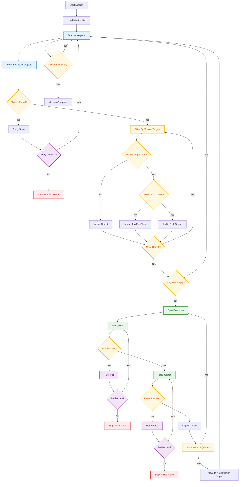

```mermaid
flowchart TD

A[Start Mission] --> R[Load Mission List]
R --> B[Scan Workspace]

B --> C[Detect & Classify Objects]
C --> D{Objects Found?}

D -->|No| RS[Retry Scan]
D -->|Yes| FL[Filter By Mission Targets]

RS --> L2{Retry Limit < 3?}
L2 -->|Yes| B
L2 -->|No| Z2[Stop: Nothing Found]

FL --> FT{Match Target Type?}
FT -->|No| FI[Ignore Object]
FT -->|Yes| REACH{Distance OK? <0.6m}

REACH -->|No| FAR[Ignore: Too Far/Close]
REACH -->|Yes| Q[Add to Pick Queue]

FI --> NF{More Objects?}
FAR --> NF
Q --> NF

NF -->|Yes| FL
NF -->|No| PQ{Is Queue Empty?}

PQ -->|Yes| B
PQ -->|No| EXEC[Start Execution]

EXEC --> P[Pick Object]
P --> OK_PICK{Pick Success?}

OK_PICK -->|No| RP1[Retry Pick]
RP1 --> RL1{Retries Left?}
RL1 -->|Yes| P
RL1 -->|No| ERR1[Stop: Failed Pick]

OK_PICK -->|Yes| PL[Place Object]
PL --> OK_PLACE{Place Success?}

OK_PLACE -->|No| RP2[Retry Place]
RP2 --> RL2{Retries Left?}
RL2 -->|Yes| PL
RL2 -->|No| ERR2[Stop: Failed Place]

OK_PLACE --> DONE_PL[Object Moved]

DONE_PL --> BM[More Items in Queue?]
BM -->|Yes| EXEC
BM -->|No| NEXTTGT[Move to Next Mission Target]

NEXTTGT --> B

B --> END_M{Mission List Empty?}
END_M -->|Yes| Z[Mission Complete]
END_M -->|No| B

%% ============================
%%          COLOR STYLES
%% ============================
classDef scan fill:#e3f2fd,stroke:#1e88e5,stroke-width:2px,color:#0d47a1;
classDef plan fill:#fff8e1,stroke:#ffb300,stroke-width:2px,color:#e65100;
classDef act fill:#e8f5e9,stroke:#43a047,stroke-width:2px,color:#1b5e20;
classDef err fill:#ffebee,stroke:#e53935,stroke-width:2px,color:#b71c1c;
classDef loop fill:#f3e5f5,stroke:#8e24aa,stroke-width:2px,color:#4a148c;

%% ASSIGN CLASSES
class B,C scan;
class D,FL,FT,REACH,NF,PQ,OK_PICK,OK_PLACE,BM,END_M plan;
class EXEC,P,PL act;
class Z2,ERR1,ERR2 err;
class L2,RP1,RL1,RP2,RL2 loop;


```
